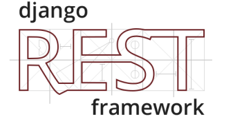
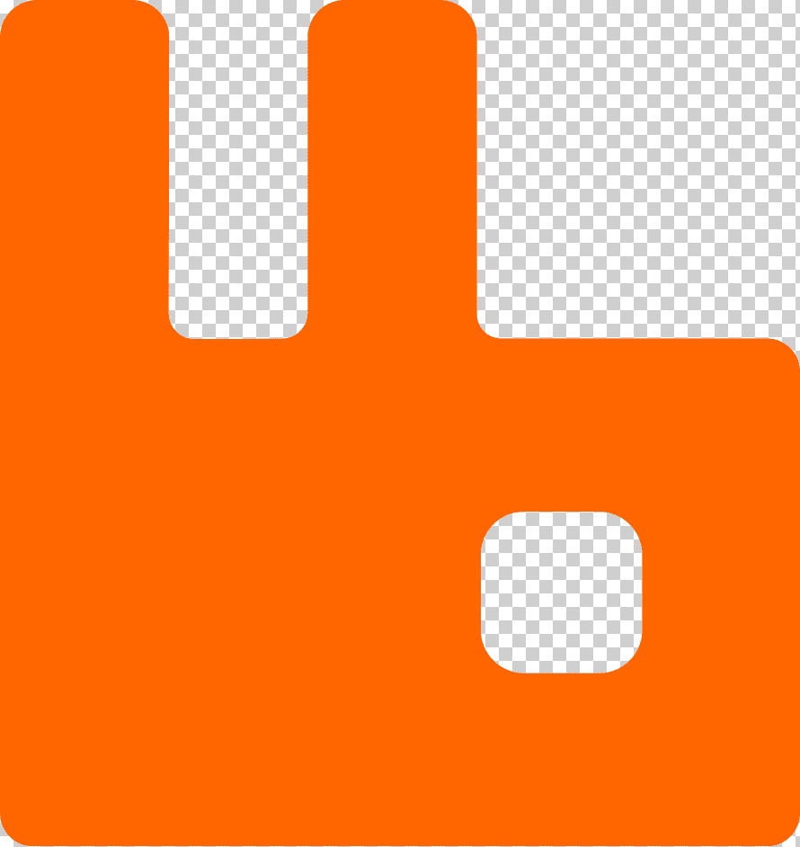

<h1 align="center">
  
</h1>

<h5 align="center">
  <code><a href="https://devscript.uz/"title="My web-site"> My web-site</a></code>
  <code><a href="https://www.instagram.com/Kenjayevdev/"title="Instagram Profile"> Instagram</a></code>
  <code><a href="https://x.com/Kenjayevdev"title="Twitter Profile"> Twitter</a></code>
  <code><a href="https://t.me/kenjayevdev"title="Telegram Profile"> Telegram</a></code>
</h5>
 
<h6 align="center">
      

        I introduce myself
        My name is Jasur Kenjayev and I am a Full Stack Developer.
        I live in Uzbekistan and I am 23 years old.
        I study at the Termez State University of Engineering and Agrotechnology, I am interested in the world of Computer Science and the internet in general. I started out interested in the world of programming from 2015, and I started learning programming from 2016, and so far I have achieved great achievements in the world of programming
      

</h6>

<h2 align="center">🔥 Languages & Frameworks & Tools & Abilities 🔥</h2>
 

  <code></code>
  <code></code>
  <code></code>
  <code></code>
  <code></code>
  <code></code>
  <code></code>
  <code></code>
  <code></code>
  <code></code>
  <code></code>
  <code></code>
  <code></code>
  <code></code>
  <code></code>
  <code></code>
  <code></code>

<h2 align="center">⚡ Stats ⚡</h2>
 

  

    
    
  

           
  

    
  

   

  

<h2 align="center">👨‍💻 Repositories 👨‍💻</h2>
 

  

      

  
  

      

  
  

      

<h4 align="center">
  <a href="https://github.com/kenjayevdev?tab=repositories" title="Show Repositories">🔎 Show More 🔍</a>
</h4>
